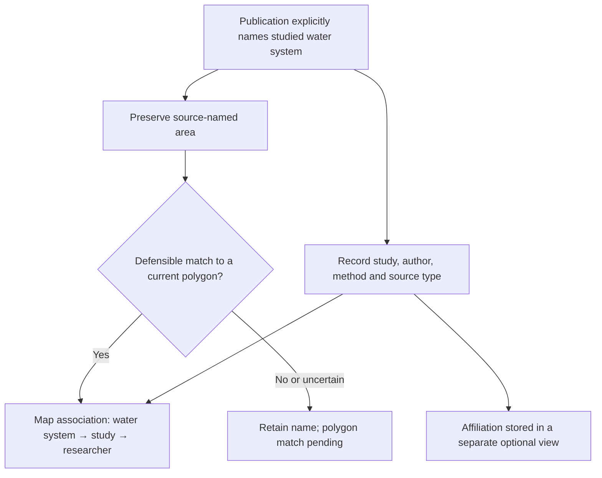

# Water Ways — evidence-to-map walkthrough

This **conceptual example** explains the documented research workflow. It uses no private study records, and it is not a capture of the working application.

## From literature to map

A scholar's university address is not evidence of their study geography. HydroBASINS level 3 is a global basin context layer; IGRAC–UNESCO 2025 maps **transboundary** aquifers, not every local aquifer. This schematic does not assert that any particular publication has a validated polygon match.

## Why the README shows 92 and 102

| Reported working-snapshot number | Population or evidence state |
| --- | --- |
| **92 researchers** | Distinct people in the publication-evidence catalogue. |
| **102 profiles** | Preserved researcher-directory profiles from the original pilot; not the same cohort as publication-evidence researchers. |
| **68 profiles** | Profiles with a source-named studied water system; a named system is not necessarily a polygon match. |
| **40 profiles** | Profiles associated with at least one currently matched 2025 transboundary-aquifer polygon. |

Do not add the counts together or describe them as competing estimates of one population. The figures are the [public README's](../README.md) working snapshot, not a census or a freshly verified release.

## What a real visual would require

An actual application screenshot is **not included**. Before adding one, confirm permission to disclose the selected study and its geometry, review the geographic data's attribution and image rights, remove unpublished records and private links, and caption the actual application version and capture date. The existing [case-study page](../index.html) is a public narrative, not the private GIS application's interface.
