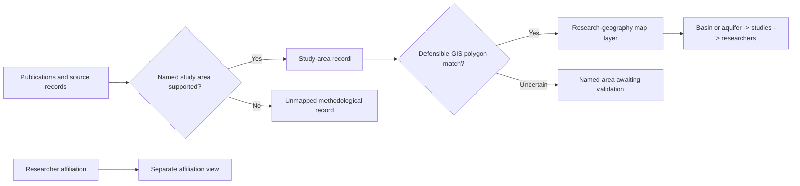

# Water Ways | Visual research case study

**Purpose:** Connect System Dynamics water-research publications to *studied water systems* rather than mistakenly using an author's institutional address as the study location. This is a public explanation of the existing project, not a release of the private application or its working data.

## Evidence-to-map diagram

**Interpretation:** This is a *conceptual data-flow diagram*, not a verified software component diagram. A source-named basin is not automatically equivalent to a GIS polygon. The 2025 IGRAC–UNESCO transboundary-aquifer layer is not an inventory of every local aquifer.

## Public evidence of the work

The [existing project README](../README.md) reports the working evidence-catalogue snapshot, source editions, matching rules, research limitations and links to HydroBASINS and IGRAC–UNESCO provenance. The public [case-study page](../index.html) explains the same research distinction. Its public-safe aggregate counts are a *dated working snapshot*, not a claim of exhaustive global coverage.

## Real screenshot and demonstration: release gate

A real screenshot of the private interactive map **has not been added**. Before attaching one, capture only an approved public-safe view; remove internal URLs, private notes, unpublished records, identifying information not already deliberately public, and any unlicensed geographic assets. Check geographic dataset attribution and redistribution rights. Do not call this Mermaid diagram a screenshot of the application. The current public HTML page is a narrative case study, not the complete interactive map.

## Suggested GitHub About fields (not automatically applied)

- **Description:** `GIS research platform mapping System Dynamics water studies to the basins and aquifers they investigate.`
- **Topics:** `system-dynamics`, `water-research`, `gis`, `research-infrastructure`, `evidence-mapping`
- **Homepage:** use the publicly verified GitHub Pages case-study URL only after checking the live page and that the repository's Pages deployment succeeded.

**Disclosure:** The canonical private research repository, internal processing scripts, raw working data, credentials and unpublished results remain private.